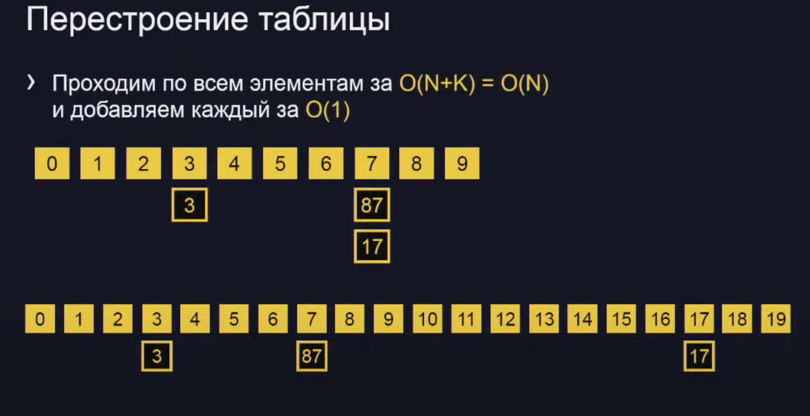
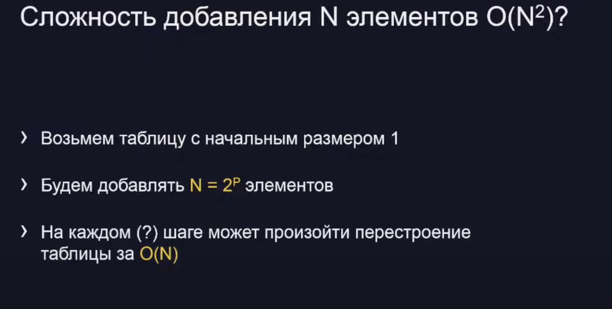

Как устроено множество:
1. Придумаем какую-нибудь функцию, которая сопоставляет каждому элементу какое-либо небольшое число
2. Вычислим функцию от элемента
3. Положим элемент в список с номером, равным значению функции

Пример функции добавления для чисел
1. Функция - последняя цифра числа X (т.е. F(X) = X % 10)
2. Вычислим функцию от элемента
3. Положим элемент в список с номером, равным значению функции

##Наше собственное (мульти)множество
setsize = 10
myset = [ [] for _ in range(setsize)]
def add (x):
myset [× % setsize].append (x)
def find(x):
for now in myset[x % setsizel]:
if now == x:
return True
return False
def delete (x) :
xlist = myset[x % setsize]
for i in range (len (xlist)):
if xlist[i] == x：
xlist[i], xlist[len(xlist) - 1] = xlist[len (xlist) - 1], xlist[i]
xlist.pop()
return

# Термины
- F(X) = × % setsize - хеш-функция
- myset (список списков) - хеш-таблица
- Совпадение значений хеш-функции для разных
параметров - коллизия

# Что можно хранить в множестве эффективно
1. Вообще говоря хранить можно что угодно - в компьютере все состоит из чисел
2. Эффективно - только неизменяемые объекты!
3. Для неизменяемых объектов можно посчитать значение хеш-функции при их создании
4. Хеш-функция должна давать равномерное распределение

# Амортизированная сложность
## Проблемы с хеш-таблицей
1. Слишком большой размер - ест много памяти O(N)
2. Слишком маленький размер - большой коэффициент заполнения и медленный поиск и удаление O(K/N)
3. Хочется иметь разумный баланс, например, коэффициент
заполнения не больше единицы (т.е. K ≤ N).
Тогда все операции в среднем будут занимать О(1)

# Решение проблемы с хеш-таблицей
Когда таблица наполнится - увеличим ее размер вдвое и перестроим!

# Амортизированная сложность
> 1. Амортизированная сложность - среднее время выполнения операции (условно)
> 2. У нас амортизированная сложность операции 0(1) - всего было N операций и суммарно на это ушло O(N)
> 3. В худшем случае отдельная операция выполняется за O(N) - может не подходить для систем реального времени

# Задача №1
Дана последовательность положительных чисел длиной N и число X
Нужно найти два различных числа А и В из последовательности, таких что А + B = X или вернуть пару 0, 0, если такой пары чисел нет.

## Решение за O(N2)
Переберем число А за O(N). Переберем число В за O(N).
Если их сумма равна Х, то вернем эту пару.

## Решение за O(N)
Будем хранить все уже обработанные числа в множестве.
Если очередное число пошпит, а X - nownum есть в множестве, то мы нашли слагаемые

def twotermswithsumx (nums, ×):
prevnums = set()
for nownum in nums:
if x - nownum in prevnums:
return nownum, x - nownum prevnums. add (nownum)
return 0, 0

# Задача №2
Дан словарь из N слов, длина каждого не превосходит К
В записи каждого из М слов текста (каждое длиной до К) может быть пропущена одна буква. Для каждого слова сказать, входит ли оно (возможно, с одной пропущенной буквой), в словарь

Решение за O(NK + M)
Выбросим из каждого слова словаря по одной букве всеми возможными способами за O(NK) и положим получившиеся
слова в множества
Для каждого слова из текста просто проверим, есть ли оно в словаре за O(1)