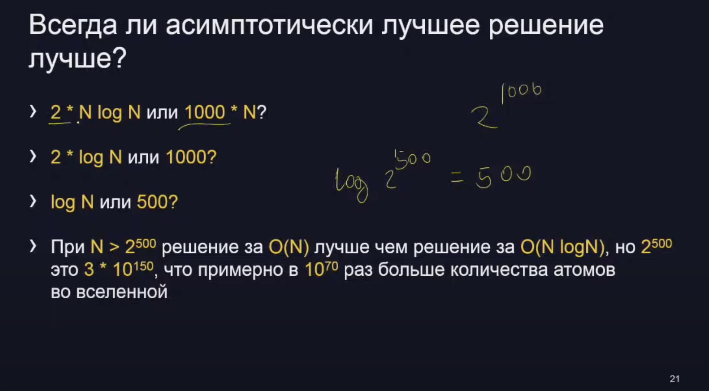

Что такое сортировка подсчетом
> Пусть необходимо отсортировать массив из N целых чисел,
каждое от 0 до К
> Обычная сортировка займет O(N logN)
> Будем считать количество вхождений каждого числа, а затем выводить каждое число столько раз, сколько оно встречалось.
Это займет O(N+K) и О(К) дополнительной памяти
> Интервал значений можно сдвинуть, чтобы он был не от 0 до К, а от минимального до максимального значения в массиве

def countsort (seq) :
minval = min (seq)
maxval = max (seg)
k = (maxval - minval + 1)
count = [0] * k
for now in seq:
count [now - minval] += 1
nowpos = 0
for val in range(0, k):
for i in range (count [val]):
sea [nowpos] = val + minval
nowDos += 1

# Задача №1
Дано два числа Х и Y без ведущих нулей
Необходимо проверить, можно ли получить первое из второго перестановкой цифр

# Словари
> Словарь - он как множество, но к каждому ключу приписано значение
> Искать по значению в словаре нельзя!
> Константа в сложности словарей заметно больше, чем у массивов, поэтому где можно - лучше использовать сортировку подсчетом
> Сортировку подсчетом неразумно использовать, если данные разреженные

# Задача #2
На шахматной доске N × N находятся М ладей (ладья бьет клетки на той же горизонтали или вертикали до ближайшей занятой)
Определите, сколько пар ладей бьют друг друга.
Ладьи задаются парой чисел | и J, обозначающих координаты клетки.
1 ≤ N ≤ 10^9, 0 ≤ M ≤ 2•10^5

# Решение
Для каждой занятой горизонтали и вертикали будем хранить количество ладей на них. Количество пар в горизонтали (вертикали) равно количество ладей минус 1. Суммируем это количество пар для всех горизонталей и вертикалей

# Задача #3
Дана строка S
Выведите гистограмму как в примере (коды символов отсортированы)
S = Hello, world!

//  #

    ＃#

    ##＃#＃#＃##＃
!,Hdelorw

# Решение
Для каждого символа в словаре посчитаем, сколько раз он встречался Найдем самый частый символ и переберем количество от этого числа до 1. Пройдем по всем отсортированным ключам и если количество больше счетчика - выведем #

# Некоторые другие критерии качества алгоритма
1. Потребление памяти
2. Время на реализацию
3. Сложность поддержки
4. Возможность распараллеливания
5. Необходимая квалификация сотрудника
6. Стоимость оборудования

# Задача #4
Сгруппировать слова по общим буквам
Sample Input: ['eat", "tea", "tan", "ate" "nat" "bat"]
Sample Output: [ ["ate", "eat", "tea"], ["'nat", "tan"], ["bat"]]

# Решение здорового человека
Отсортируем в каждом слове буквы и это будет выступать в роли ключа, а значением будет список слов
def groupwords (words) :
groups = ?
for word in words: sortedword =
1 join(sorted(word))
if sortedword not in groups:
groups [sortedword] = []
groups [sortedword].append (word)
ans = []
for sortedword in groups:
ans.append (groups [sortedword])
return ans

Подозрения здорового человека
Вдруг слово будет длинное (N)? Сортировка займет O(N log N).
Количество различных букв в слове К ≤ N, можем посчитать количество каждой за O(N) и отсортировать за O(K log K), теоретически